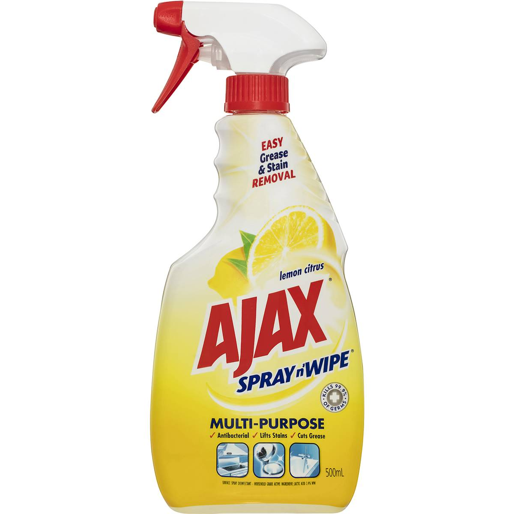
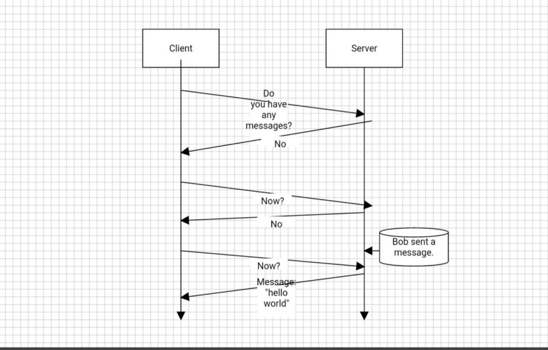
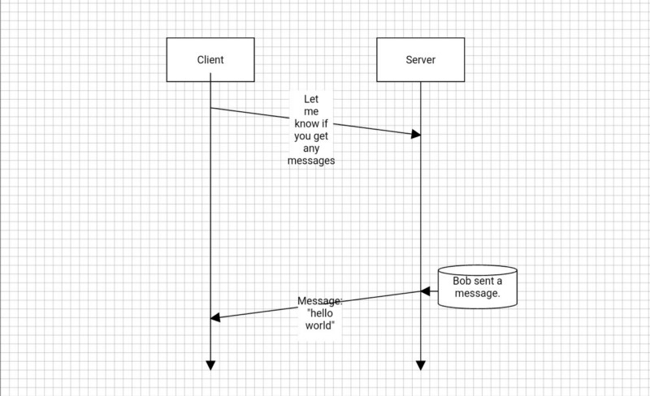
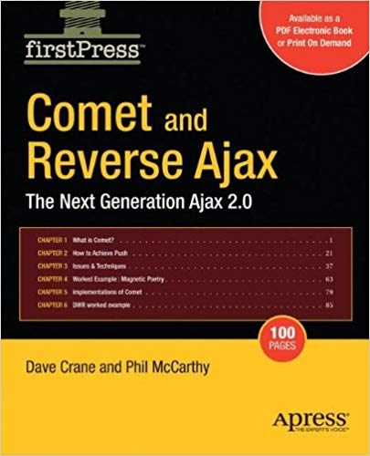
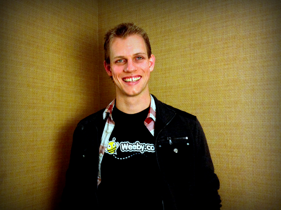
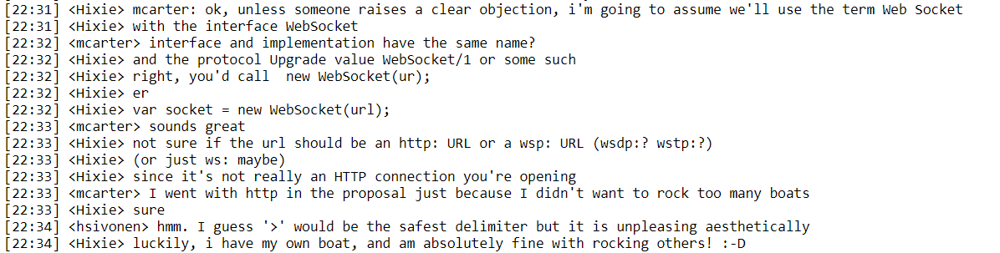
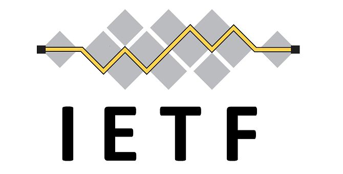
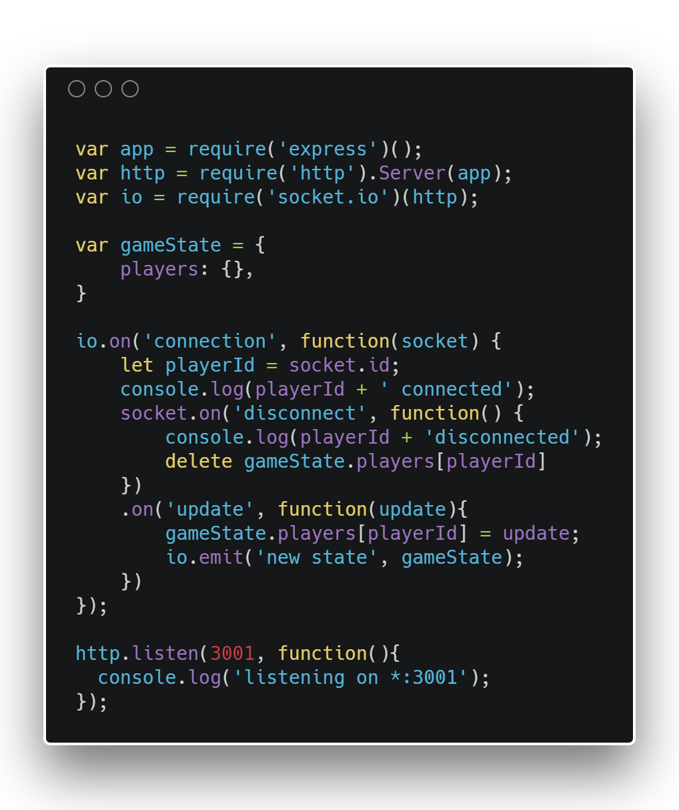

# Web Sockets and Socket.io
_The best integrated bi-directional transport protocol since Flash, Silverlight and Java did their things..._

```notes
Welcome.
Remember to launch the chatserver(game) and the chatserver(chat/index.js)
```
---
# What are Web Sockets? 🤔

```notes
API That allows you to open an interactive communication session between the user's brower and the a server.
With the API, the user is able to send messages to a server and recieve event-driven responses without having to poll the server for a reply.
```
---
# And the point is?

```notes
Realtime communication between a browser and a server.
```
---

Vs.

---


---
# A quick history of the Web Socket...

```notes
Starting from Early 2008...
```
---


```notes
Before the Web Socket there was Comet.
The Comet library was the AJAX solution that aimed to make applications behave as though they had a bi-directional transport layer.
Referred to as Long-polling or Reverse AJAX.
```
---


Michael Carter

```notes
Protocol development initially driven by Michael Carter.
Michael worked on the comet library.
```
---
# <strong>T</strong>ransmission<strong> C</strong>ontrol <strong>P</strong>rotocol <em>Connection</em>

```notes
First referred to as the TCPConnection or the TCP-based socket API. Michael takes into the WHATWG IRC channel.
```
---


Ian Hickson

```notes
Ian Hickson - One of the more well known spec writers on the html5 spec. Spokesperson for WHATWG (Web Hypertext Application Technology Working Group)
Michael Carter collaborates with Ian Hickson to further develop the spec.
```
---


```notes
June 2008 TCPConnection is renamed as Web socket and by early July is referenced as such in the HTML5 spec.
```
---


```notes
The next big news happens a year and a half later.
December 2009 - Google Chrome 4 releases on the developer stream with the first implementation of web Sockets
On January 25th 2010 sees Chrome 4's public release and Web Sockets are in the wild for the first time.
```
---


```notes
In Febuary of the same year, Hickson takes the standard to the IETF (Internet Engineering Task Force) where two revisions were authored under him.
By 2011 Ian Fette has taken the baton and on April 22nd releases an updated spec.
Fette is joined by Alexy Melnikov and together they release further updates from July 2011 when the spec goes to RFC.
In December 2011 Fette and Melnikov release the final version of the RFC specification.
```
---
Browser Deployment

```notes
- Public deployments
Chrome 16 - 13th December 2011
Firefox 11 - March 13th 2012
Safari 6 - July 25th 2012
Internet Explorer 10 - October 26th 2012
Opera 12.10 - November 5, 2012
```

---


What was that Socket.io thing?
---

---
# In action!

import Stage from './components/Stage/Stage';

<Stage width={600} height={600} />

http://10.193.176.165:3000

---
# Using Websockets

_Your turn..._
---
```bash
git clone ***
npm install socket.io-client --save
```
---
First, import the socket.io client to your component...

```javascript
import io from 'socket.io-client';
//
this.socket = io(***:4001);
this.socket.emit('new message', {
	author: 'Your name',
	message: 'Your Message',
});
```
---
import ChatWindow from './components/ChatWindow';

<ChatWindow />
---
# Further reading

- http://html5doctor.com/interview-with-ian-hickson-html-editor/
- https://krijnhoetmer.nl/irc-logs/whatwg/20080618
- https://lists.w3.org/Archives/Public/public-whatwg-archive/2008Jun/0165.html
- https://tools.ietf.org/html/draft-hixie-thewebsocketprotocol-75
