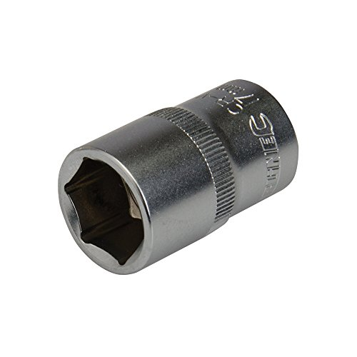
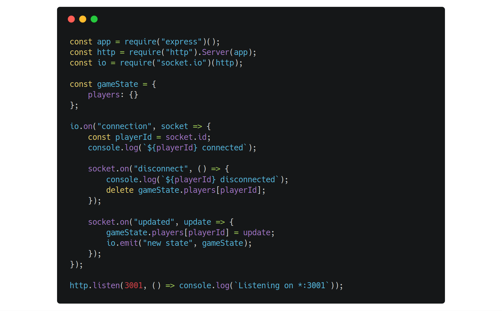

# Websockets and Socket.io
_The best bi-directional transport protocol since Flash, Silverlight and Java._

```notes
- Welcome
```
---
# What are websockets? 🤔

```notes
API That allows you to open an interactive communication session between the user's brower and the a server.
With the API, the user is able to send messages to a server and recieve event-driven responses without having to poll the server for a reply.
```
---
A quick history of the Websocket...
---

```notes
Protocol development initially driven by Michael Carter&mdash;Michael previously worked on the comet library.
```
---
- First referred to as the TCPConnection or the TCP-based socket API.
- Added to the HTML5 specification by Ian Hickson in 2008.
- Google releases the first Websocket implementation in Chrome 4 (December 2009)
# And the point is?
Any operation where we need the server (or other recepticle) to talk to the browser, without the browser pestering for an update!
---

Vs.

---


---


What was that Socket.io thing?
---

---
# In action!

import Stage from './components/Stage/Stage';

<Stage width={600} height={600} />

http://10.193.176.165:3000

---
# Using Websockets

_Your turn..._
---
```bash
git clone ***
npm install socket.io-client --save
```
---
First, import the socket.io client to your component...

```javascript
import io from 'socket.io-client';
//
this.socket = io(***:4001);
this.socket.emit('new message', {
	author: 'Your name',
	message: 'Your Message',
});
```
---
import ChatWindow from './components/ChatWindow';

<ChatWindow />
---
# The end
